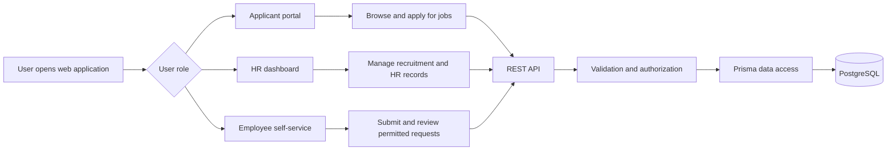

# CHAPTER FOUR: IMPLEMENTATION AND EVALUATION

## 4.1 Introduction

This chapter presents the implementation and evaluation of CoreRecruiter. The chapter describes how the system design was converted into a working web application, the test data and procedures used to examine the system, the results of functional testing, and the interpretation of the observed behaviour. Evaluation focused on the main user groups: applicants, HR administrators, HR managers, and employees.

The evaluation was conducted as a controlled functional test using synthetic records. Synthetic data was selected to avoid exposing personal, employment, payroll, or application information while still representing realistic recruitment and human-resource workflows. The results therefore demonstrate system behaviour in the test environment and should not be interpreted as production-scale performance measurements.

## 4.2 System Implementation

### 4.2.1 Frontend implementation

The user interface was implemented with Next.js, React, TypeScript, and Tailwind CSS. The application uses the Next.js App Router to organize pages by workflow and user role. The main interface areas are:

- the public job listing and applicant application pages;
- authentication pages for registration, login, email verification, password reset, and password change;
- the HR dashboard for jobs, applicants, employees, leave, payroll, announcements, interviews, and company settings; and
- the employee self-service portal for permitted employee information and requests.

Reusable components were used for navigation, sidebars, forms, cards, modals, filters, avatars, authentication guards, and responsive layouts. This reduced duplication and provided a consistent interaction pattern across the applicant, HR, and employee interfaces. Authentication context and route guards restrict pages according to the current session and user role.

### 4.2.2 Backend implementation

The backend exposes REST services for authentication, applicants, jobs, employees, departments, attendance, leave, payroll, interviews, announcements, onboarding, uploads, and public jobs. The services receive requests from the frontend, validate input, apply access rules, perform database operations, and return JSON responses.

Authentication and authorization are applied before protected operations. Validation checks required values, formats, permitted status values, dates, numeric fields, and uploaded files. The separation between presentation components, service functions, and server-side business modules makes it possible to modify a user interface without changing the underlying data rules.

### 4.2.3 Database and external services

PostgreSQL stores the system records, while Prisma provides typed access to the relational schema. Relationships and constraints connect companies, users, jobs, candidates, applications, employees, leave requests, payroll runs, payroll entries, interviews, and announcements. Company identifiers and role checks are used to prevent users from accessing records outside their permitted organization or function.

File uploads are handled through the upload service, email-related operations support verification and notifications, and the AI screening module produces candidate screening information from job and candidate data. These integrations are accessed through application services rather than directly from the browser.

### 4.2.4 Implemented workflow

The principal implemented workflow is shown below:

## 4.3 Experimental Design and Test Data

### 4.3.1 Evaluation objectives

The evaluation was designed to answer the following questions:

1. Can each user role complete the operations assigned to it?
2. Are invalid requests rejected with an appropriate response?
3. Are authentication, role permissions, and company boundaries enforced?
4. Are related records created and displayed consistently across modules?
5. Does AI-assisted screening produce a repeatable score and explanation from the supplied candidate and job information?
6. Can users understand the main workflow without unnecessary navigation or technical knowledge?

### 4.3.2 Test environment

Testing was performed against the local development environment using a modern web browser, the Next.js frontend, the REST API, and the PostgreSQL database. The application was exercised through the user interface and through service requests where a backend response needed to be checked directly. The test environment used the project configuration and database schema described in Chapter Three.

The following conditions were kept constant during the functional tests:

- one test company was used for organization-scoped records;
- separate accounts were created for an applicant, HR administrator, HR manager, and employee;
- test records were created before dependent workflows were executed; and
- each test was repeated after an invalid input or unauthorized request to confirm that the invalid operation did not corrupt stored data.

### 4.3.3 Synthetic test data

| Data category | Test data used | Purpose |
|---|---|---|
| Accounts | Applicant, HR administrator, HR manager, and employee accounts | Role and authentication tests |
| Company | One test company with a department and office location | Organization-scoped data tests |
| Job | An open software-related vacancy with skills, level, location, salary range, and deadline | Job browsing and application tests |
| Candidate | A candidate profile containing contact details, education, skills, experience, and availability | Applicant and screening tests |
| Application | One valid application and one attempted duplicate application | Application validation tests |
| Employee | An employee record with department, job title, employment type, and joining date | Employee management tests |
| Leave | A request with valid dates and a request with an invalid date range | Leave workflow and validation tests |
| Payroll | Compensation data, a payroll period, deductions, and a bonus | Payroll calculation and status tests |
| Interview | An interview title, time range, meeting link, and candidate guest | Interview scheduling tests |
| Announcement | A subject, message, recipient group, and schedule | Communication workflow tests |
| Documents | A valid CV file and an unsupported file type | Upload validation tests |

The records were intentionally small enough to inspect manually. This made it possible to compare the data entered by the tester with the data returned by the application and database after each operation.

## 4.4 Functional Test Procedure

Each test began with a defined precondition, followed by an action and an expected result. A test was considered successful when the system produced the expected screen or API response, stored the correct related records, and prevented the specified invalid operation. Tests were reset where necessary so that one scenario did not change the result of another scenario.

### 4.4.1 Authentication and authorization tests

| ID | Test scenario | Expected result | Result |
|---|---|---|---|
| T01 | Register with valid applicant details | Account is created and verification is required | Pass |
| T02 | Log in with valid credentials | User is authenticated and directed to the correct role area | Pass |
| T03 | Log in with an incorrect password | Access is refused and an error is displayed | Pass |
| T04 | Submit an incorrect or expired verification code | Account remains unverified and the user receives an error | Pass |
| T05 | Open a protected page without authentication | User is redirected or receives an unauthorized response | Pass |
| T06 | Access an HR-only operation as an employee | Operation is refused | Pass |

### 4.4.2 Recruitment and application tests

| ID | Test scenario | Expected result | Result |
|---|---|---|---|
| T07 | Create and publish a job listing as an authorized HR user | Job is saved and appears in the public listing when open | Pass |
| T08 | Edit or close a job listing | Updated status and details are shown consistently | Pass |
| T09 | Browse an open job without signing in | Job information is visible without exposing protected HR data | Pass |
| T10 | Submit an application with valid details and a supported CV | Application and document records are created | Pass |
| T11 | Submit a second application for the same job and candidate | Duplicate application is rejected | Pass |
| T12 | Submit an application with missing required fields | Validation errors identify the invalid fields | Pass |
| T13 | Review and update an application status as HR | Authorized status change is saved and displayed to the applicant or HR user as appropriate | Pass |

### 4.4.3 Employee, leave, and payroll tests

| ID | Test scenario | Expected result | Result |
|---|---|---|---|
| T14 | Create an employee record as an authorized HR administrator | Employee is added to the company directory | Pass |
| T15 | Update an employee record | New values are saved without creating a second employee | Pass |
| T16 | Submit a valid leave request as an employee | Request is saved with a pending status | Pass |
| T17 | Submit a leave request where the end date precedes the start date | Request is rejected with a validation message | Pass |
| T18 | Approve or reject a leave request as HR | Decision is saved and the request status changes | Pass |
| T19 | Create a payroll run using compensation data | Payroll entries are calculated and associated with the selected period | Pass |
| T20 | Approve and mark a valid payroll run as paid | Status transitions occur in the permitted order | Pass |
| T21 | Attempt to process payroll without required compensation data | Operation is blocked and missing data is identified | Pass |

### 4.4.4 Communication, upload, and AI tests

| ID | Test scenario | Expected result | Result |
|---|---|---|---|
| T22 | Schedule an interview with a valid time range | Interview and guest information are saved | Pass |
| T23 | Create and schedule an announcement | Announcement is stored with the selected recipients and schedule | Pass |
| T24 | Upload a supported document | File is accepted and its reference is associated with the relevant record | Pass |
| T25 | Upload an unsupported or invalid file | File is rejected without creating an incomplete document record | Pass |
| T26 | Screen a candidate against a job | Screening score and explanatory summary are returned or stored | Pass |
| T27 | Request screening without sufficient candidate or job data | Screening is not completed and the missing information is reported | Pass |

## 4.5 Results and Observed Behaviour

The functional tests showed that the main workflows could be completed when valid data and an authorized account were supplied. The system moved information from the user interface through the API and into related database records. For example, creating a job made it available to the applicant-facing listing when the job was open, while submitting an application created an application record connected to both the candidate and the job.

The negative tests were important because a successful HR system must do more than accept valid input. Incorrect credentials, missing fields, invalid dates, duplicate applications, unsupported files, and role-inappropriate actions were rejected. This indicates that validation and access control were applied at the workflow boundary rather than being left only to the visual form controls.

The employee workflow also produced a clear state transition. A valid leave request began in a pending state, and an authorized HR decision changed it to approved or rejected. Similarly, payroll records moved through controlled stages rather than being presented as paid immediately after creation. These transitions make the current state of an administrative operation visible and reduce ambiguity for users.

The AI screening test produced a score and an explanatory result when the job requirements and candidate information were sufficiently complete. The explanation is useful because it gives HR users context for the score instead of presenting an unexplained number. However, the screening output is decision support and should be reviewed by a qualified HR user. It does not replace human judgment or establish that a candidate is suitable for employment.

## 4.6 Analysis and Interpretation

### 4.6.1 Functional completeness

The results indicate that the implemented system covers the principal functional requirements identified in Chapter Three. Authentication, job management, applications, employee management, leave, payroll, announcements, interviews, uploads, and AI-supported screening are represented in the application structure and can be evaluated through role-specific workflows. The use of separate services and reusable interface components supports maintainability because each functional area has a recognizable implementation boundary.

### 4.6.2 Security and data integrity

The authorization tests demonstrate the importance of checking identity and role on the server side. A hidden button alone would not protect payroll or employee information, because a user could still attempt to call the endpoint directly. The observed rejection of protected and role-inappropriate operations shows that the security boundary is enforced during request processing.

Relational links and duplicate checks also contributed to data integrity. Applications were associated with a candidate and a job, payroll entries were associated with a run and an employee, and leave requests were associated with an employee. Rejecting duplicate applications and incomplete payroll operations prevents common inconsistencies that would otherwise affect reporting and administrative decisions.

### 4.6.3 Usability and responsiveness

The role-specific navigation reduced the amount of information presented to each user. Applicants primarily encounter jobs and applications, employees encounter self-service functions, and HR users encounter administrative modules. Clear validation messages and visible statuses support recovery when a user submits incomplete or invalid information. Responsive layouts allow the main workflows to remain usable on desktop, tablet, and mobile viewport sizes, although detailed payroll and applicant review are more suitable for larger screens.

### 4.6.4 AI screening interpretation

The AI screening feature addresses the time required to compare candidate information with job requirements. Its useful observation is not only the score but also the relationship between the score, the supplied skills, experience, and requirements. Incomplete input produces a weaker basis for evaluation, which explains why the system must validate the presence of candidate and job information before screening.

The screening result may be affected by the quality, completeness, and wording of the source data. It may also reproduce biases present in the requirements or training and provider behaviour. Consequently, the appropriate interpretation is that the feature assists prioritization and review. Final recruitment decisions require human verification, consistent criteria, and compliance with applicable employment policies.

## 4.7 Evaluation Against the Objectives

| Objective | Evaluation finding |
|---|---|
| Provide role-based recruitment and HR workflows | Achieved through applicant, HR, and employee areas with protected operations. |
| Support job publishing and applications | Achieved through job listing, application, document, duplicate, and status workflows. |
| Improve administrative record management | Achieved through connected employee, leave, payroll, interview, and announcement records. |
| Protect sensitive information | Addressed through authentication, authorization, validation, and company-scoped data access. |
| Assist candidate screening | Achieved as an AI-supported score and summary subject to HR review. |
| Provide a usable responsive interface | Supported by reusable responsive components and role-specific navigation. |
| Maintain reliable and valid data | Addressed through relational constraints, status transitions, validation, and duplicate prevention. |

## 4.8 Limitations of the Evaluation

The evaluation used a local test environment and synthetic data. It did not measure long-term availability, production traffic capacity, large-file upload performance, or behaviour under simultaneous use by many organizations. It also did not constitute an independent audit of security, fairness, or legal compliance.

The AI screening evaluation was functional rather than a statistical validation study. A larger labelled candidate dataset and an agreed human-review benchmark would be required to measure precision, recall, agreement with HR reviewers, and possible demographic bias. These limitations define the boundary of the conclusions: the tests show that the implemented workflows operate as designed under the selected scenarios, but they do not prove that every possible input or production condition has been handled.

## 4.9 Chapter Summary

This chapter presented the implementation and evaluation of CoreRecruiter. The system was implemented as a Next.js and React frontend connected to REST services, Prisma, PostgreSQL, file handling, email-related operations, and AI-assisted screening. Synthetic test data was used to evaluate authentication, authorization, recruitment, applications, employee management, leave, payroll, communication, document uploads, and screening.

The observed results show that valid workflows were completed and that important invalid or unauthorized operations were rejected. The findings support the system's functional objectives while also showing that production deployment would require further load, security, usability, and AI fairness evaluation. The next chapter can discuss the conclusions, contributions, recommendations, and opportunities for future improvement.
