# CHAPTER THREE: SYSTEM ANALYSIS AND DESIGN

## 3.1 Development Methodology

The **Agile methodology with iterative prototyping** was adopted for the development of CoreRecruiter. Agile was selected because the system consists of several related modules, including recruitment, applicant management, employee self-service, leave management, payroll, announcements, interview scheduling, and AI-assisted candidate screening. These modules required continuous refinement as functional and user-interface requirements became clearer during development.

The methodology followed these activities:

1. **Requirements identification:** The expected users, system objectives, and operational problems were identified. The main user groups were applicants, HR administrators, HR managers, and employees.
2. **System planning:** The system was divided into authentication, company onboarding, job management, applicant management, employee management, leave, payroll, interviews, announcements, and AI screening modules.
3. **Interface prototyping:** Preliminary layouts were developed for the applicant portal, HR dashboard, and employee self-service portal.
4. **Incremental implementation:** The frontend was developed with Next.js, React, and TypeScript. The backend was developed with Express.js and TypeScript.
5. **Database development:** PostgreSQL was used with Prisma as the object-relational mapper.
6. **Testing and refinement:** Features were tested for input validation, authentication, database operations, access control, and expected output.
7. **Integration:** The frontend, backend, database, file upload, email, and AI services were integrated.
8. **Deployment preparation:** Environment configuration, API documentation, health monitoring, database migrations, and background jobs were prepared.

Agile was suitable because it allowed changes to be made progressively without redesigning the entire system. Recruitment functionality could be developed and tested before employee self-service and payroll features were added.

### Figure 3.1: Agile Development Cycle

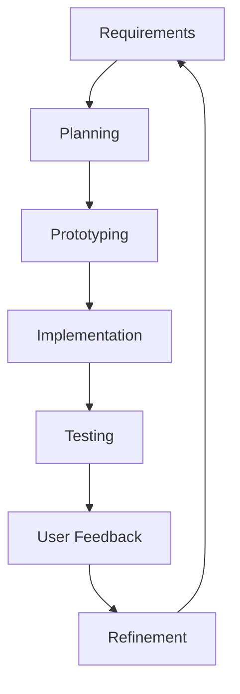

## 3.2 Requirements Analysis

Requirements were divided into functional requirements, which describe what the system does, and non-functional requirements, which describe system quality and operating conditions.

### 3.2.1 Functional Requirements

| ID | Requirement | Description |
|---|---|---|
| FR01 | User registration | The system shall allow HR users and applicants to create accounts. |
| FR02 | Authentication | The system shall allow registered users to log in with valid credentials. |
| FR03 | Email verification | The system shall verify email addresses using a one-time password. |
| FR04 | Password recovery | The system shall support password reset after verification. |
| FR05 | Role-based access | The system shall provide different permissions for HR administrators, HR managers, employees, applicants, and super administrators. |
| FR06 | Company onboarding | HR administrators shall register company information. |
| FR07 | Job management | Authorized HR users shall create, edit, publish, close, and delete job listings. |
| FR08 | Public job browsing | Applicants shall view available job listings. |
| FR09 | Applicant profiles | Applicants shall manage personal details, qualifications, skills, experience, education, and availability. |
| FR10 | Job applications | Applicants shall submit applications and upload CVs and supporting documents. |
| FR11 | Applicant management | HR users shall search, filter, and review applications. |
| FR12 | Candidate screening | The system shall generate AI-assisted screening scores and summaries. |
| FR13 | Application statuses | HR users shall update application statuses. |
| FR14 | Interview scheduling | HR users shall schedule interviews and add guests. |
| FR15 | Employee management | HR users shall create, update, search, and deactivate employee records. |
| FR16 | Departments and locations | Authorized users shall manage departments and office locations. |
| FR17 | Leave management | Employees shall submit leave requests and HR users shall approve or reject them. |
| FR18 | Employee self-service | Employees shall access permitted personal, leave, payroll, and document information. |
| FR19 | Payroll management | HR users shall configure, calculate, approve, and process payroll. |
| FR20 | Announcements | HR users shall create, schedule, send, update, and delete announcements. |
| FR21 | Document management | The system shall upload documents and extract text where applicable. |
| FR22 | Audit logging | Important user and administrative activities shall be recorded. |
| FR23 | AI assistant | The system shall provide AI-supported recruitment and HR operations. |
| FR24 | Scheduled tasks | The system shall perform scheduled screening, interview reminders, and maintenance tasks. |
| FR25 | API monitoring | The system shall provide Swagger API documentation and a health-check endpoint. |

### 3.2.2 Non-Functional Requirements

| ID | Requirement | Description |
|---|---|---|
| NFR01 | Security | Restricted resources shall require authentication and authorization. |
| NFR02 | Data privacy | Personal, applicant, employee, and payroll data shall be protected by role and company boundaries. |
| NFR03 | Usability | The system shall provide clear navigation, forms, messages, and dashboards. |
| NFR04 | Responsiveness | The interface shall work on desktop, tablet, and mobile screens. |
| NFR05 | Performance | Normal requests shall be processed within an acceptable time, with pagination for large lists. |
| NFR06 | Availability | The backend shall provide health monitoring and remain available during normal operation. |
| NFR07 | Reliability | Invalid input shall be rejected and errors handled appropriately. |
| NFR08 | Data integrity | Keys, constraints, indexes, and relationships shall maintain consistent data. |
| NFR09 | Scalability | The system shall support multiple companies, users, jobs, and applicants. |
| NFR10 | Maintainability | The system shall use modular TypeScript, reusable components, controllers, validation, and migrations. |
| NFR11 | Interoperability | Frontend and backend shall communicate through REST APIs using JSON. |
| NFR12 | Portability | The system shall run on compatible Windows or Linux environments with Node.js and PostgreSQL. |
| NFR13 | Auditability | Administrative actions shall be traceable by user, company, action, metadata, and timestamp. |
| NFR14 | Extensibility | Additional HR modules and integrations shall be addable without redesigning the core system. |
| NFR15 | Backup and recovery | Database and uploaded documents should be backed up regularly. |
| NFR16 | Input validation | Requests shall be checked for required fields, valid formats, types, and permitted values. |
| NFR17 | Duplicate prevention | Duplicate applications and duplicate payroll entries shall be prevented. |

## 3.3 Input Design

CoreRecruiter uses structured forms to collect, validate, and process information from applicants, HR users, and employees. The main input categories are authentication, company onboarding, job listings, applicant profiles, applications, employees, leave, payroll, interviews, announcements, and document uploads.

| Input Form | Main Fields | User |
|---|---|---|
| Registration | Name, email, password | Applicant, HR user |
| Login | Email, password | All users |
| Company onboarding | Company name, industry, address, country, city, website | HR administrator |
| Job listing | Title, department, type, level, location, salary, deadline, requirements, skills | HR user |
| Applicant profile | Name, phone, location, qualification, skills, experience, education, availability | Applicant |
| Application | Job, expected salary, CV, cover letter, portfolio | Applicant |
| Employee | Employee ID, name, email, job title, department, office, employment type, phone, joining date | HR user |
| Leave request | Leave type, dates, reason | Employee |
| Interview | Title, start time, end time, guests, link, description | HR user |
| Payroll | Salary, bonus, deductions, currency, payment method, period | HR user |
| Announcement | Subject, message, recipients, schedule | HR user |
| Document upload | File name, type, file content | Applicant, employee |

Input is validated by the backend before processing. Required fields, email formats, passwords, dates, numeric values, permitted options, duplicate records, and uploaded files are checked. Invalid requests return field-specific errors. The backend uses Zod validation through the validation middleware.

## 3.4 Output Design

The system produces outputs for applicants, HR users, employees, and administrators. These include HR dashboard summaries, public job listings, applicant profiles, AI screening scores, interview calendars, employee directories, leave statuses, payroll summaries, announcements, reports, audit activities, and validation or authentication messages.

Output screens should be clear, readable, role-specific, and suitable for desktop and mobile use. Recommended screenshots include the HR dashboard, applicant management page, public job listing, employee self-service dashboard, payroll page, and leave page.

## 3.5 Database Design

CoreRecruiter uses PostgreSQL as its relational database and Prisma as its object-relational mapper. The database uses primary keys, foreign keys, enumerated status values, unique constraints, indexes, and migrations.

Major entities include `Company`, `User`, `Session`, `Employee`, `Department`, `OfficeLocation`, `Invitation`, `AuditLog`, `Job`, `JobItem`, `JobSkill`, `Candidate`, `CandidateSkill`, `CandidateExperience`, `CandidateEducation`, `Application`, `ApplicationDocument`, `Interview`, `InterviewGuest`, `LeaveRequest`, `PayrollRun`, `PayrollEntry`, `EmployeeCompensation`, `PayrollSettings`, and `Announcement`.

Important relationships include:

- One company has many users, employees, departments, jobs, and office locations.
- One department has many employees and jobs.
- One job receives many applications.
- One candidate may apply for multiple jobs.
- One application belongs to one candidate and one job.
- One employee may submit many leave requests and have many payroll entries.
- One payroll run contains many payroll entries.
- One interview may contain many candidate guests.

The complete entity structure is defined in the Prisma schema.

## 4.1 Entity-Relationship Diagram

```mermaid
erDiagram
    COMPANY ||--o{ USER : has
    COMPANY ||--o{ EMPLOYEE : employs
    COMPANY ||--o{ DEPARTMENT : contains
    COMPANY ||--o{ JOB : publishes
    COMPANY ||--o{ OFFICE_LOCATION : has
    DEPARTMENT ||--o{ EMPLOYEE : includes
    DEPARTMENT ||--o{ JOB : manages
    JOB ||--o{ APPLICATION : receives
    CANDIDATE ||--o{ APPLICATION : submits
    APPLICATION ||--o{ APPLICATION_DOCUMENT : includes
    EMPLOYEE ||--o{ LEAVE_REQUEST : submits
    EMPLOYEE ||--o{ PAYROLL_ENTRY : has
    PAYROLL_RUN ||--o{ PAYROLL_ENTRY : contains
    INTERVIEW ||--o{ INTERVIEW_GUEST : includes
    CANDIDATE ||--o{ INTERVIEW_GUEST : attends
    USER ||--o{ INTERVIEW : schedules
    USER ||--o{ ANNOUNCEMENT : creates

    COMPANY { string id PK; string name }
    USER { string id PK; string email UK; string role; string companyId FK }
    EMPLOYEE { string id PK; string employeeId UK; string companyId FK }
    DEPARTMENT { int id PK; string companyId FK; string name }
    JOB { string id PK; string title; string status; string companyId FK }
    CANDIDATE { string id PK; string name; string email UK }
    APPLICATION { string id PK; string candidateId FK; string jobId FK; string status; int aiScore }
    APPLICATION_DOCUMENT { string id PK; string applicationId FK; string name; string url }
    LEAVE_REQUEST { int id PK; string employeeId FK; string type; string status }
    PAYROLL_RUN { string id PK; string companyId FK; string status }
    PAYROLL_ENTRY { string id PK; string payrollRunId FK; string employeeId FK; int netPay }
    INTERVIEW { string id PK; string createdById FK; string title }
    INTERVIEW_GUEST { string id PK; string interviewId FK; string candidateId FK }
    ANNOUNCEMENT { string id PK; string createdById FK; string subject }
```

## 5.1 Use-Case Diagram and Descriptions

### Figure 5.1: Use-Case Diagram

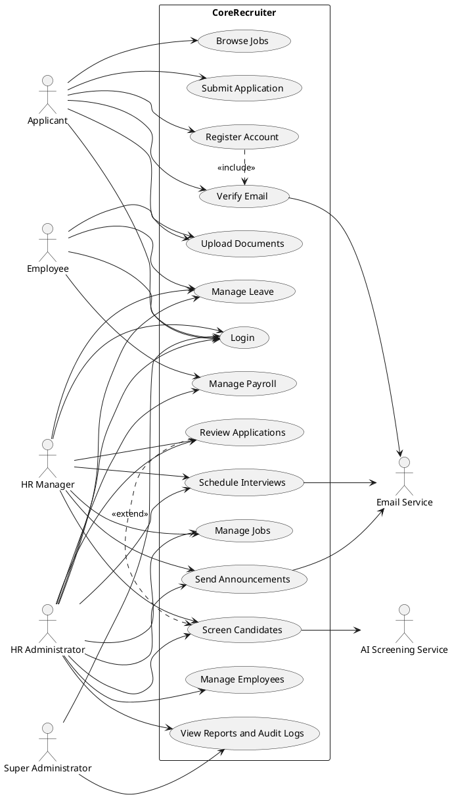

### Use-Case Summaries

| Use Case | Actor | Description |
|---|---|---|
| User registration | Applicant, HR user | Creates an account and sends an email verification code. |
| User login | All authenticated roles | Validates credentials and opens the correct dashboard. |
| Manage jobs | HR administrator, HR manager | Creates, edits, publishes, closes, and deletes job listings. |
| Submit application | Applicant | Completes an application and uploads supporting documents. |
| Review applications | HR administrator, HR manager | Searches, filters, views, and updates applications. |
| Screen candidates | HR administrator, HR manager | Compares candidate information with job requirements and produces a score. |
| Manage employees | HR administrator | Creates and maintains employee records. |
| Manage leave | Employee and HR users | Submits, reviews, approves, or rejects leave requests. |
| Manage payroll | HR administrator | Configures, calculates, approves, and processes payroll runs. |
| Manage interviews and announcements | HR users | Schedules interviews and sends or schedules announcements. |

## 6. Flowcharts

### 6.1 Job Application Flowchart

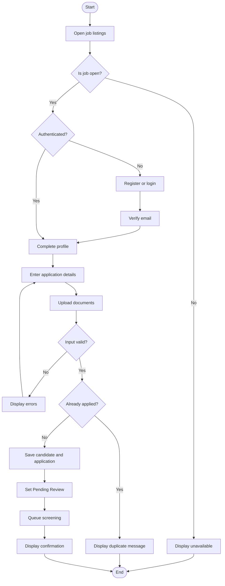

### 6.2 Authentication Flowchart

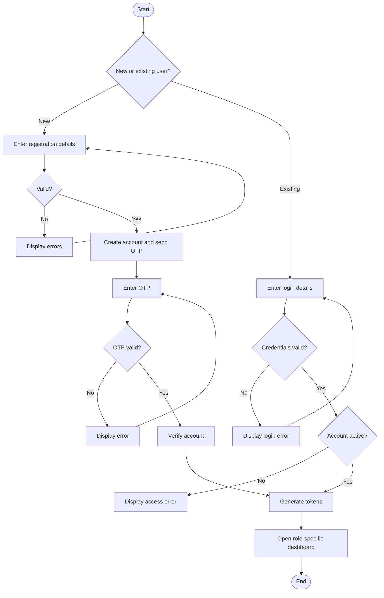

### 6.3 Leave Request Flowchart

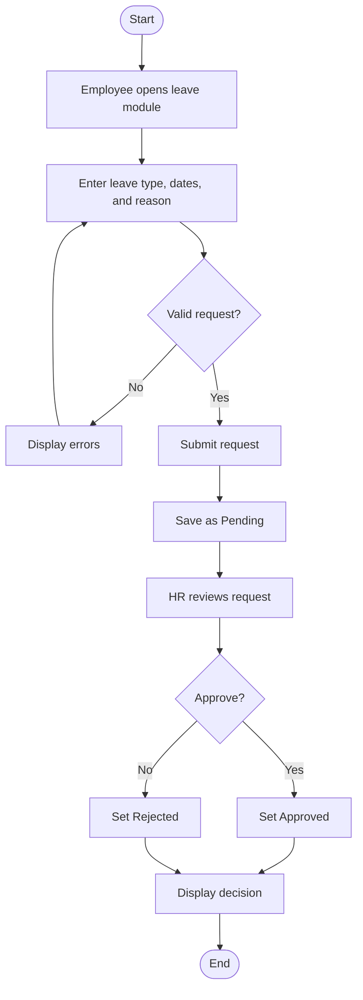

### 6.4 Payroll Processing Flowchart

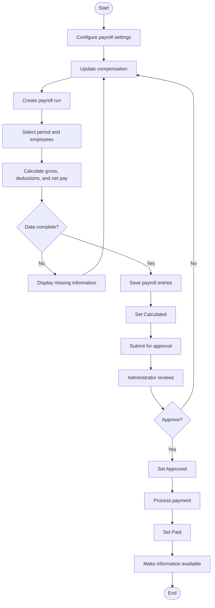

## 7. Sequence Diagrams

### 7.1 Login Sequence Diagram

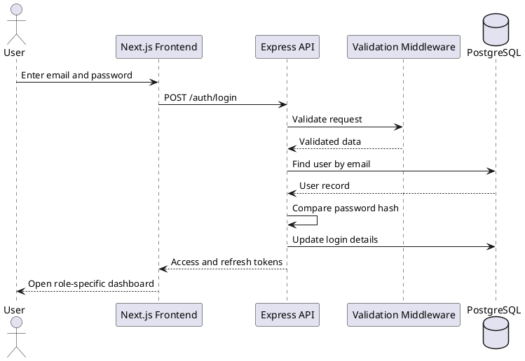

### 7.2 Application Sequence Diagram

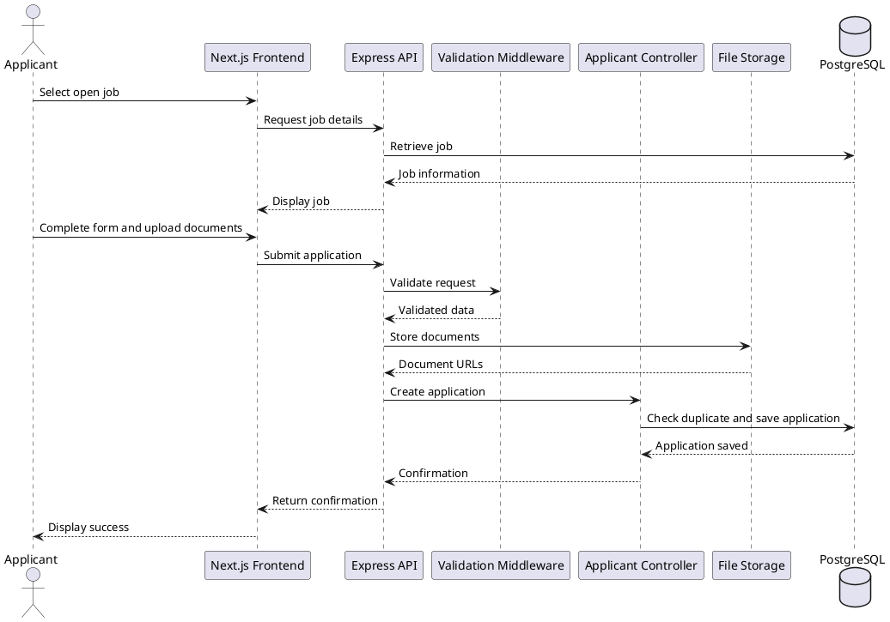

### 7.3 AI Screening Sequence Diagram

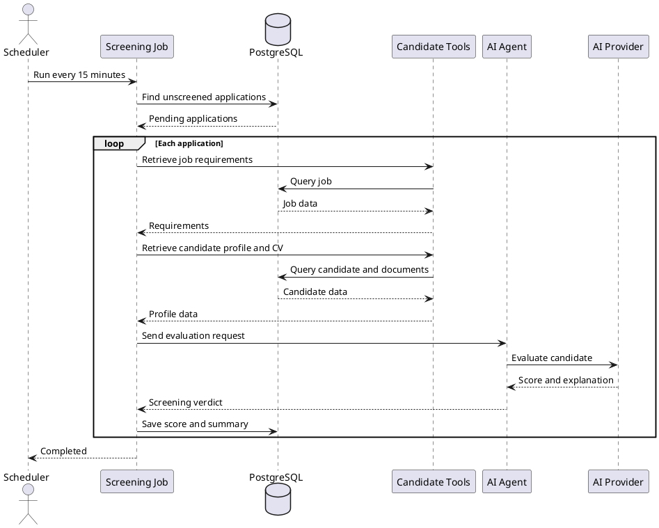

### 7.4 Payroll Sequence Diagram

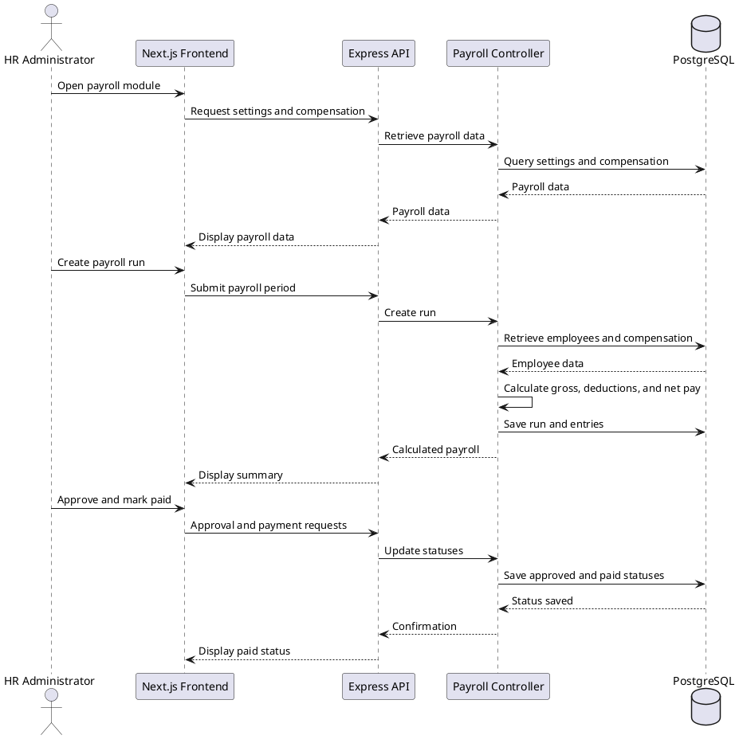

## 8.1 Backend Class Diagram

```plantuml
@startuml
skinparam classAttributeIconSize 0
class PasswordAuthController { +register(); +login(); +verifyOtp(); +resetPassword() }
class JobListingController { +getJobs(); +createJob(); +updateJob(); +deleteJob() }
class JobApplicantsController { +getAllApplicants(); +getApplicationById(); +updateApplicationStatus() }
class EmployeesController { +getEmployees(); +createEmployee(); +updateEmployee(); +deleteEmployee() }
class LeaveController { +getLeaveRequests(); +createLeaveRequest(); +updateLeaveStatus() }
class PayrollController { +getSettings(); +createRun(); +approveRun(); +markRunPaid() }
class AnnouncementsController { +createAnnouncement(); +getAnnouncements(); +updateAnnouncement(); +deleteAnnouncement() }
class AIController { +chat(); +chatStream(); +screenCandidate() }
class ProtectedMiddleware { +authenticate() }
class ValidationMiddleware { +validate(schema) }
class PrismaClient { +user; +company; +job; +candidate; +application; +employee; +payrollRun }
class Company
class User
class Job
class Candidate
class Application
class Employee
class LeaveRequest
class PayrollRun
class PayrollEntry
PasswordAuthController --> PrismaClient
JobListingController --> PrismaClient
JobApplicantsController --> PrismaClient
EmployeesController --> PrismaClient
LeaveController --> PrismaClient
PayrollController --> PrismaClient
AnnouncementsController --> PrismaClient
AIController --> PrismaClient
ProtectedMiddleware --> PrismaClient
ValidationMiddleware ..> PasswordAuthController
Company "1" o-- "*" User
Company "1" o-- "*" Employee
Company "1" o-- "*" Job
Job "1" o-- "*" Application
Candidate "1" o-- "*" Application
Employee "1" o-- "*" LeaveRequest
Employee "1" o-- "*" PayrollEntry
PayrollRun "1" o-- "*" PayrollEntry
@enduml
```

The controllers receive HTTP requests and coordinate operations. Middleware handles authentication, authorization, and validation. Prisma provides access to PostgreSQL, while domain entities represent stored business records.

## 9. Component Architecture Diagram

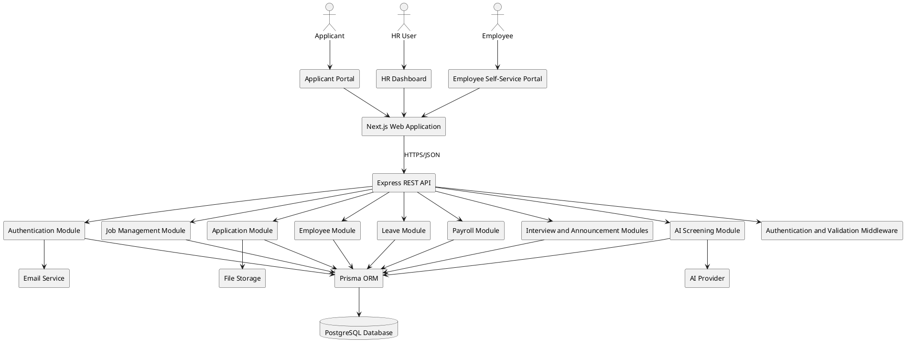

The architecture separates presentation, business logic, data access, database, and external services. The browser communicates with the API, and external services are accessed by backend modules rather than directly by users.

## 10. Network and Deployment Design

```plantuml
@startuml
left to right direction
node "Applicant Device" as ApplicantDevice { artifact "Web Browser" }
node "HR or Employee Device" as UserDevice { artifact "Web Browser" }
cloud Internet
node "Web Hosting Environment" as WebHost { component "Next.js Frontend" as Frontend }
node "Application Server" as AppServer {
  component "Express REST API" as API
  component "Authentication and Authorization" as Security
  component "Business Modules" as Modules
  component "Scheduled Background Jobs" as Scheduler
}
database "PostgreSQL Database Server" as Database
cloud "External Services" {
  component "Email Service" as Email
  component "Google Authentication" as Google
  component "File Storage" as Storage
  component "AI Provider" as AI
}
ApplicantDevice --> Internet : HTTPS
UserDevice --> Internet : HTTPS
Internet --> Frontend : Load application
Frontend --> API : REST/JSON over HTTPS
API --> Security
API --> Modules
Modules --> Database : Prisma queries
Scheduler --> Database
Security --> Database
API --> Email
API --> Google
API --> Storage
Modules --> AI
@enduml
```

The production network should use HTTPS, restrict direct database access, protect secrets with environment variables, and provide regular database and document backups. The API provides `/health` for monitoring.

## 11. Hardware and Software Requirements

### 11.1 Hardware Requirements

| Component | Minimum | Recommended |
|---|---:|---:|
| Processor | Dual-core | Intel Core i5/AMD Ryzen 5 or better |
| Memory | 8 GB RAM | 16 GB RAM or more |
| Storage | 10 GB free | 20 GB SSD free |
| Display | 1366 x 768 | Full HD |
| Network | Stable internet | Broadband internet |
| Production server | 2 vCPUs, 4 GB RAM, 25 GB SSD | 4 vCPUs, 8 GB RAM, 50 GB SSD |

### 11.2 Software Requirements

| Software | Purpose |
|---|---|
| Windows, Linux, or macOS | Operating system |
| Node.js and npm | Runtime and package management |
| Next.js and React | Frontend application |
| TypeScript | Frontend and backend development |
| Express.js | REST API server |
| PostgreSQL | Relational database |
| Prisma | Object-relational mapper |
| Git | Version control |
| Visual Studio Code | Development environment |
| Modern web browser | Access and testing |
| Jest and Supertest | Backend testing |
| Swagger/OpenAPI | API documentation |
| Tailwind CSS | Frontend styling |

### 11.3 Supporting Services

Email delivery, Google authentication, file storage, AI services, hosting, and SSL/TLS may be configured for complete production operation. Exact production specifications should only be stated when supported by deployment records.

## References to Implementation

- Frontend pages: `core-recruiter/app/`
- Backend routes: `core-recruiter-server1/src/routes/`
- Backend modules: `core-recruiter-server1/src/Modules/`
- Database schema: `core-recruiter-server1/prisma/schema.prisma`
- API setup: `core-recruiter-server1/src/app.ts`
- Screening job: `core-recruiter-server1/src/jobs/screening.job.ts`
