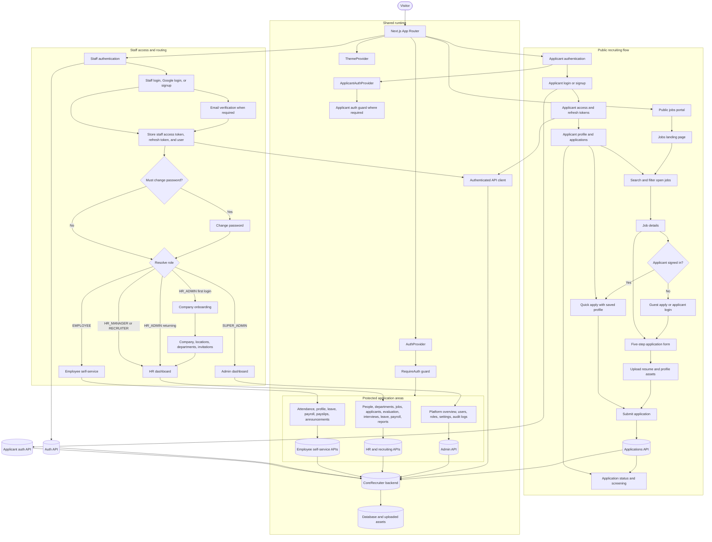

# CoreRecruiter System Flow

## Main routes

- Public recruiting: `/jobs`, `/jobs/(listing)/job-listing`, `/apply/[id]`, and `/apply/apply`.
- Staff authentication: `/auth/login`, `/auth/signup`, email verification, password reset, and password change.
- Company setup: `/onboarding` and `/onboarding/company-info` for a first-time HR admin.
- Admin portal: `/dashboard/admin` and its platform-management sections.
- HR portal: `/dashboard/hr` and its people, hiring, payroll, leave, and reporting sections.
- Employee portal: `/dashboard/ess`, which redirects to `/dashboard/ess/attendance`.

## Data boundary

The UI calls domain services under `services/`, which use `lib/api-client.ts` to reach the backend. Staff and applicant sessions use separate token storage and auth contexts. Protected layouts enforce access on the client before rendering their portal shell.
